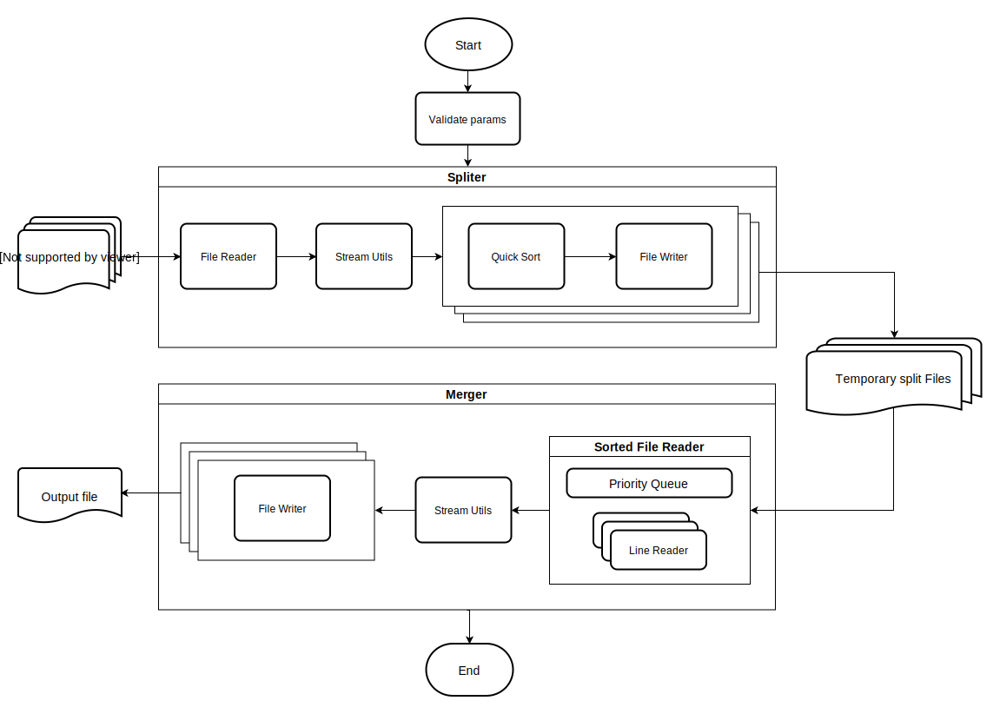

# How to run?

#### System requirments:
* JDK 11
* Maven 3.6

#### Build and run:
```sh
# Compile source code and build JAR package. All the artifacts will be inside "target" directory.
mvn package
cd target

# Run the JAR package using following parameters
#
# srcPath: A valid file path or a directory path to read files. If a directory, "fileExtensions" need to provide.
#
# destPath: A valid non-esists file path, will be used to save the sorted file.
#
# k: A valid number >= 2, that restrics max number of words will be proccessed at any time.
#
# fileExtensions: Coma-separated file extensions i.e ".txt,.log". Required if "srcPath" is a directory.
#
# tempDir: Optional dir path will be used to save split files. System specific temp dir will be used if not provided.

java -jar -DtempDir=[tempDirPath] bigsort-1.0.jar [srcPath] [destPath] [k] [file extensions(if srcPath is a directory)]
```

#### Run tests:
```sh
mvn test
```

#### Prebuilt demo:
```sh
# Go to demo directory
cd demo

# Run bigsort JAR with sample data
#
#           tempDir(optional)   JAR package        srcPath     destPath     k       file extensions(as srcPath is a directory)
java -jar -DtempDir=./sample    bigsort-1.0.jar    ./sample    ./out.txt    500     .txt
```

#### Docker demo:
```sh
# Build docker image with "bigsort" tag
docker build -t bigsort .

# Run bigsort container
docker run bigsort
```

### Design considerations
* High cohesion and low coupling
* Testablity
* Readability
* Memory efficiency

# Flowchart
